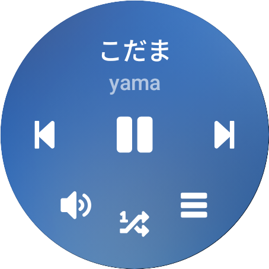
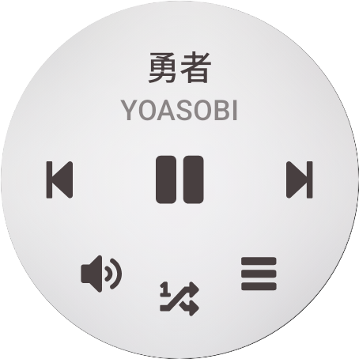
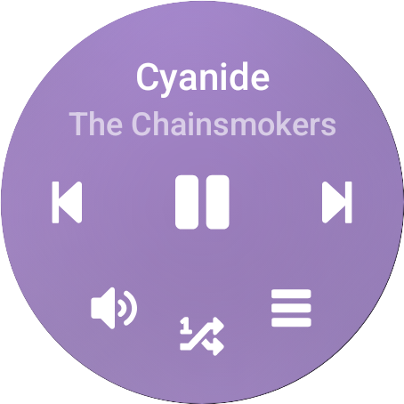
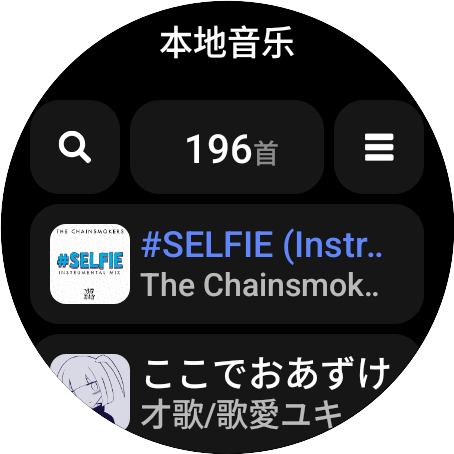
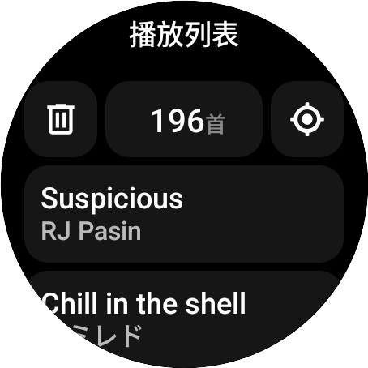
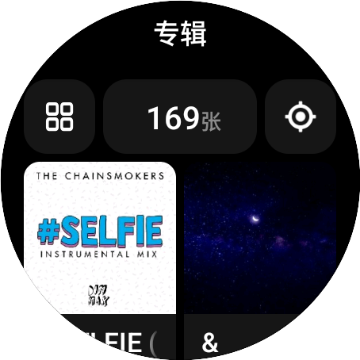
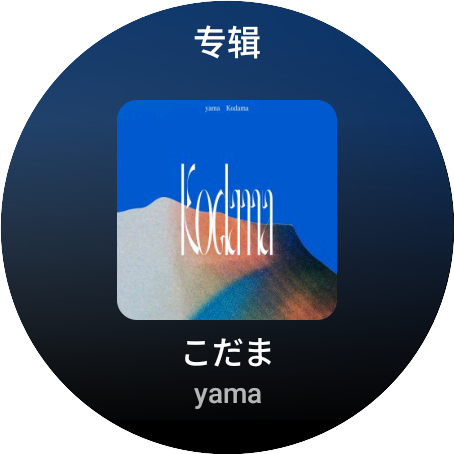
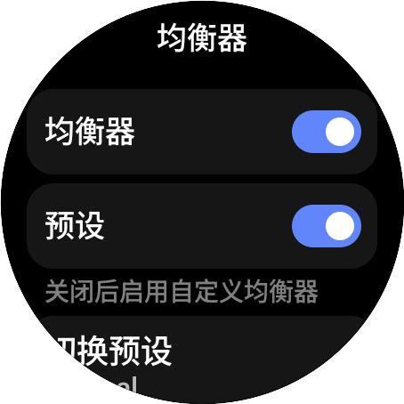
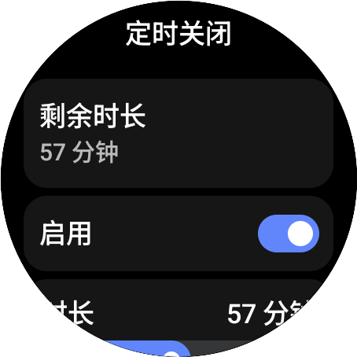
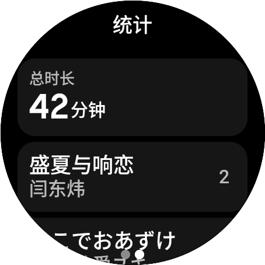

# 零度音乐

### 3.0 版本即将发布

## 应用截图

           

尝试成为手表端最好的本地音乐播放器

## 新版本带来了什么?

重构软件底层, 新架构, 新体验
  
重写数据库逻辑, 采用开发框架, 避免老旧架构的潜在问题
重写歌词界面, 增强歌词动效,
重写播放逻辑, 采用多播放内核, 实现更多音频数字信号处理功能
重写界面布局, 使用少量代码即可使大部分界面适配方/圆屏幕
还重写了更多...
  
下面是软件的全新功能:
  
- 歌单逻辑的优化
- UI 的统一设计
- 静态流体播放背景
- 定时器的全新设计
- 设置页的全新设计
- 专辑页的全新设计
- 艺术家页的全新设计
- 多艺术家的正确切割
- OPPO 表冠正确支持
- 均衡器, 压限器支持
- 单击播放作为全局使用
- 扫描音乐逻辑全新设计
- 滚轮调节音量的动画效果
- 本地音乐的展示排序支持
- 新增一个可有可无的快捷菜单
- 新的播放模式: 随机单曲循环
- 歌词字体的增强(支持字重字体)
- 使用系统缩略图缓存代替应用内置缓存
- 播放统计(总时长, 播放次数, 今日时长)
- 同时支持 MediaPlayer 和 ExoPlayer

等等

> [!NOTE]
> 零度音乐测试硬件平台为 **Galaxy Watch 5 44MM**

## 特别感谢
[零度音乐前端页面](https://github.com/Sh1n3zZ/ZeroMusicFrontend)
[Sh1n3zZ](https://github.com/Sh1n3zZ/)
[LightXi](https://github.com/LightXi)

## 特别说明

> [!NOTE]
> 零度音乐为非开源应用，此仓库只用于介绍应用
