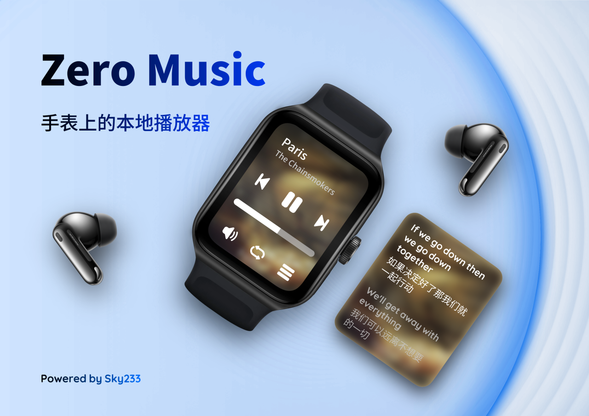
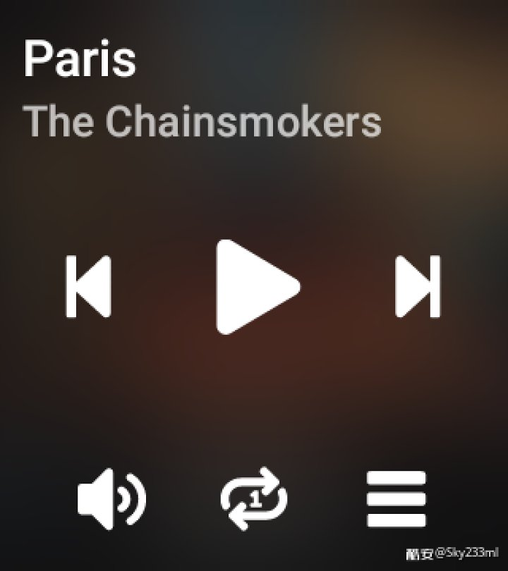
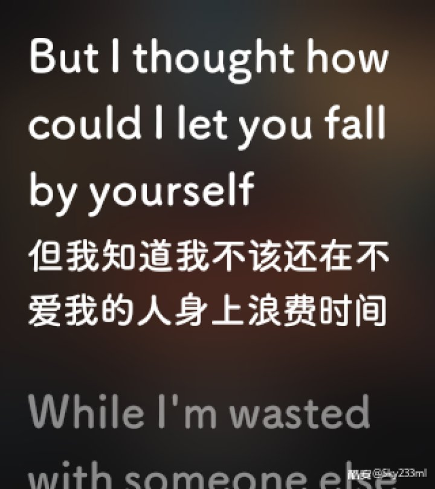
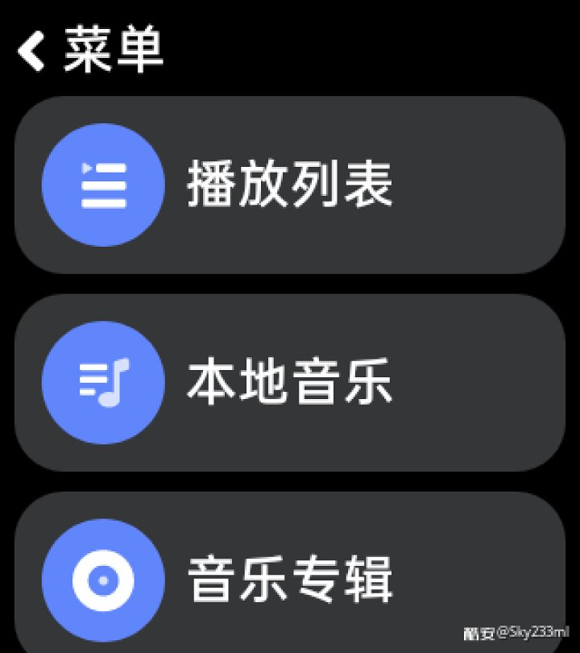
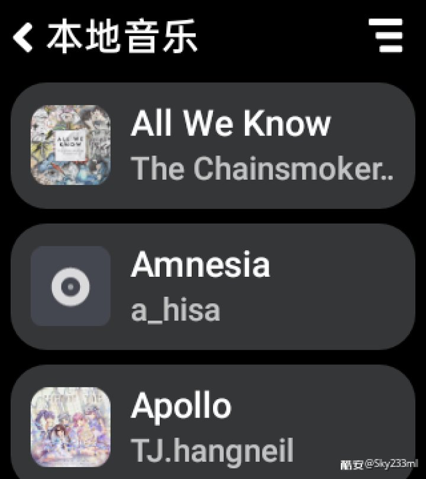

# 零度音乐

尝试成为手表端最好的本地音乐播放器

## 有什么功能

- 好看的歌词&播放页面
- 自定义歌词字体大小
- 自定义背景模糊度
- 歌词翻译
- 播放进度条
- 播放列表
- 自定义歌单
- 专辑，歌手
- 定时关闭
- 蓝牙线控
- 歌曲&文件夹黑名单
- 网络歌词
- 超强的后台存活能力
- 浏览器扫描局域网传输
- 自定义歌词字体
- 自定义播放背景
- 自定义应用缩放程度
- 圆屏适配

等等

## 应用截图
<figure class="third">
     

</figure>

## 特别说明

> 零度音乐为非开源应用，此仓库只用于介绍
